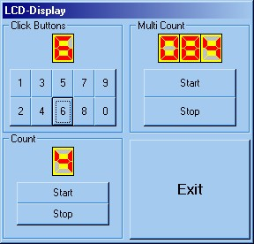



## LCD\-Screen

### Description

This is an LCD-Screen for use in mp3-players or digital clocks.

This app creates LCD numbers by using the BitBlt function and is verry easy to use.

this code is commented in English and Dutch.
 
### More Info
 

             |
---                |---
**Submitted On**   |2001-10-05 06:28:34
**By**             |[Peter Hebels](https://github.com/Planet-Source-Code/PSCIndex/blob/master/ByAuthor/peter-hebels.md)
**Level**          |Advanced
**User Rating**    |4.7 (14 globes from 3 users)
**Compatibility**  |VB 6\.0
**Category**       |[Miscellaneous](https://github.com/Planet-Source-Code/PSCIndex/blob/master/ByCategory/miscellaneous__1-1.md)
**World**          |[Visual Basic](https://github.com/Planet-Source-Code/PSCIndex/blob/master/ByWorld/visual-basic.md)
**Archive File**   |[LCD\-Screen333021142001\.zip](https://github.com/Planet-Source-Code/peter-hebels-lcd-screen__1-28650/archive/master.zip)

